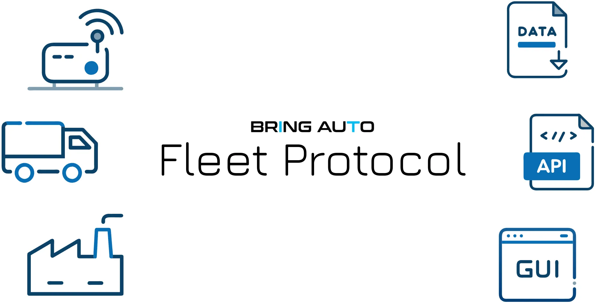

# Fleet Protocol

**Connect any device from anywhere to everywhere!**



## General

Fleet Protocol is a **modular** communication technology developed by BringAuto to allow for **simple and reliable** communication between
devices deployed in an **internet-connection-unstable** environment and cloud infrastructure.

Protocol consists of three parts:

- Internal Client (Remote) - part of a device which communicates with a Module Gateway
- Module Gateway (Remote):
  - internal server - communicates with internal clients
  - aggregator - aggregates status messages, gathers and aggragates messages in case of connection outage, ...
  - external client - communicates with an External Server
- External Server (Cloud) - deployed as part of the cloud infrastructure. It provides status messages and can be used to control devices by command messages.

## Communication protocol

[ProtoBuf] (see [Protobuf version]) is used to serialize and deserialize messages. The message format
specification can be found in the protobuf folder.

Each message must be prefixed with a four bytes long (uint32_t data type) header, which holds
information about the size of the Protobuf message.

Check the Fleet Protocol v2 documentation to learn more about the system architecture:

- [Summary] - overall high-level summary
- [Fleet Protocol Requirements]
- [Internal Client]
- [Module Gateway]
- [External Server]
- [Modules] - list of implemented modules
- [Message Structure]
- [Internal Client design]
- [Module Gateway design]
- [External Server design]

Implementation of each respective component:

- [Module Gateway impl]
- [External Server impl]
- Internal Client
  - [Internal Client C++ impl] - C++ implementation, only on Posix, no libraries used
  - [Internal Client Python3 impl]
  - [Internal Client Arduino impl] - basic implementation for Arduino 32bit boards
- Modules
  - [Mission Module] - Autonomy Control module
  - [IO Module] - Input/Output devices
  - [Example Module]

All supported modules can be listed by [fleet-protocol-module] topic.

## HTTP Interface

The Fleet Protocol HTTP API represents the protocol in the form of an HTTP API.

A Fleet Protocol Module can use the HTTP API to provide its statuses and retrieve commands
through a simple and understandable REST API for easy integration with other services.

Fleet Protocol HTTP API is a standalone project and is not part of the Fleet Protocol v2 core specification.

- [HTTP API]
- [HTTP API C++ Client]
- [HTTP API Python3 Client]
- [HTTP API Wait Mechanism]


## Protocol messages

Messages are described by ProtoBuf v3.

If a message field is not mandatory, then it's marked as OPTIONAL by "OPTIONAL"
as the last comment in documentation for the given field.
Optional fields have defaults as described in the [ProtoBuf] v3 doc.

## Repo structure

This repository contains a basic C API and CMake project to easily
implement Fleet Protocol Modules.

### Examples

Samples of fleet-protocol features usage.

Use CMake option `BRINGAUTO_SAMPLES=ON` to configure them.

### Lib

Header files of interfaces

### Protobuf

Compiled and non-compiled protobuf files

## Usage

### Requirements

- [CMlib](https://github.com/cmakelib/cmakelib)

### Installation

To install the library, first configure the project with the CMake option BRINGAUTO_INSTALL=ON and BRINGAUTO_PACKAGE=ON, and then install it.

```bash
mkdir _build && cd _build
cmake -DBRINGAUTO_INSTALL=ON -DBRINGAUTO_PACKAGE=ON ..
make install
```

### Package

To create a package, configure the project with CMake option BRINGAUTO_PACKAGE=ON and then create it using `cpack`.

```bash
mkdir _build && cd _build
cmake -DBRINGAUTO_INSTALL=ON -DBRINGAUTO_PACKAGE=ON ..
cpack
```

### Using library in CMake projects

Once the library is installed, it can be used in other projects by adding the following lines to the `CMakeLists.txt`
file:

```cmake
FIND_PACKAGE(fleet-protocol-interface REQUIRED)
TARGET_LINK_LIBRARIES(<target> PUBLIC fleet-protocol-interface::fleet-protocol-interface)
```

This will link all interfaces. If you want to only link a specific interface, chose from the interfaces listed below:

- fleet-protocol-interface::common-headers-interface
- fleet-protocol-interface::internal-client-interface
- fleet-protocol-interface::module-gateway-interface
- fleet-protocol-interface::module-maintainer-external-server-interface
- fleet-protocol-interface::module-maintainer-module-gateway-interface
- fleet-protocol-interface::protobuf-cpp-interface

> Note that `protobuf-cpp-interface` also needs `protobuf::libprotobuf` to be linked to the target

[ProtoBuf]: https://developers.google.com/protocol-buffers
[Protobuf version]: https://github.com/protocolbuffers/protobuf/releases/tag/v3.21.12
[Summary]: https://ref.bringautofleet.com/r/protocol/v2/2.0.1/summary
[Fleet Protocol Requirements]: https://ref.bringautofleet.com/r/protocol/v2/2.0.1/protocol-requirements
[Internal Client]: https://ref.bringautofleet.com/r/protocol/v2/2.0.1/internal-client
[Module Gateway]: https://ref.bringautofleet.com/r/protocol/v2/2.0.1/module-gateway
[External Server]: https://ref.bringautofleet.com/r/protocol/v2/2.0.1/external-server
[Modules]: https://ref.bringautofleet.com/r/protocol/v2/2.0.1/modules
[Message Structure]: https://ref.bringautofleet.com/r/protocol/v2/2.0.1/message-structure
[Internal Client design]: https://ref.bringautofleet.com/r/protocol/v2/2.0.1/internal-client-design
[Module Gateway design]: https://ref.bringautofleet.com/r/protocol/v2/2.0.1/module-gateway-design
[External Server design]: https://ref.bringautofleet.com/r/protocol/v2/2.0.1/external-server-design
[HTTP API]: https://github.com/bringauto/fleet-protocol-http-api
[HTTP API Wait Mechanism]: https://ref.bringautofleet.com/r/protocol/http-api/1.0.0/wait-mechanism
[HTTP API C++ Client]: https://github.com/bringauto/fleet-protocol-http-client-cxx
[HTTP API Python3 Client]: https://github.com/bringauto/fleet-protocol-http-client-python
[fleet-protocol-module]: https://github.com/topics/fleet-protocol-module
[Module Gateway impl]: https://github.com/bringauto/module-gateway
[External Server impl]: https://github.com/bringauto/external-server
[Internal Client C++ impl]: https://github.com/bringauto/internal-client-cpp
[Internal Client Python3 impl]: https://github.com/bringauto/internal-client-python
[Internal Client Arduino impl]: https://github.com/bringauto/internal-client-arduino
[Mission Module]: https://github.com/bringauto/mission-module
[IO Module]: https://github.com/bringauto/io-module
[Example Module]: https://github.com/bringauto/example-module
